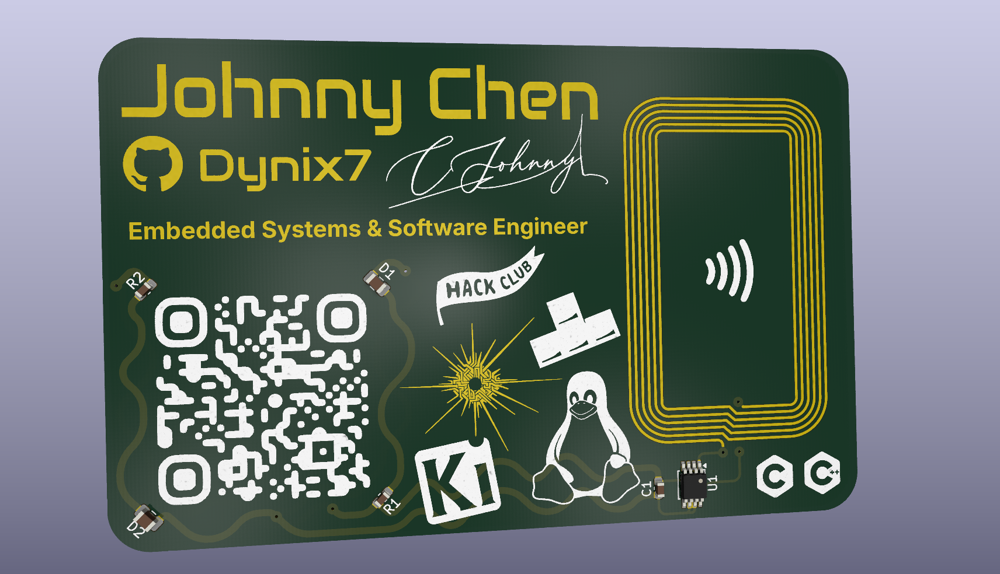
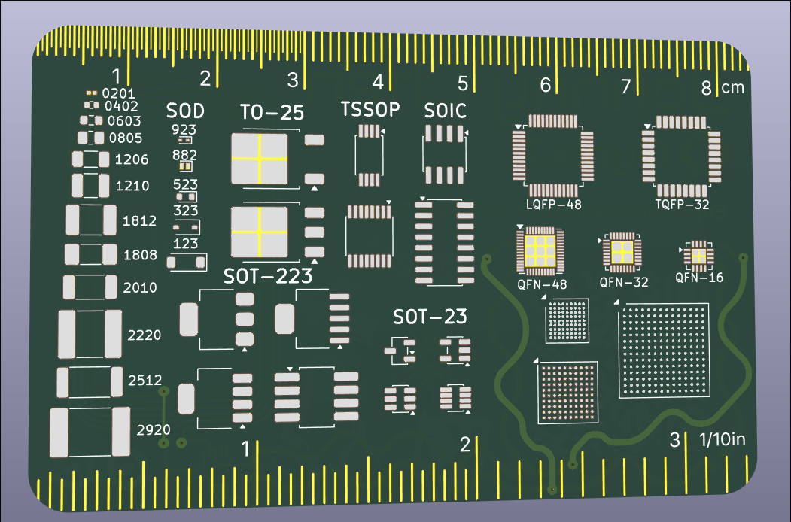
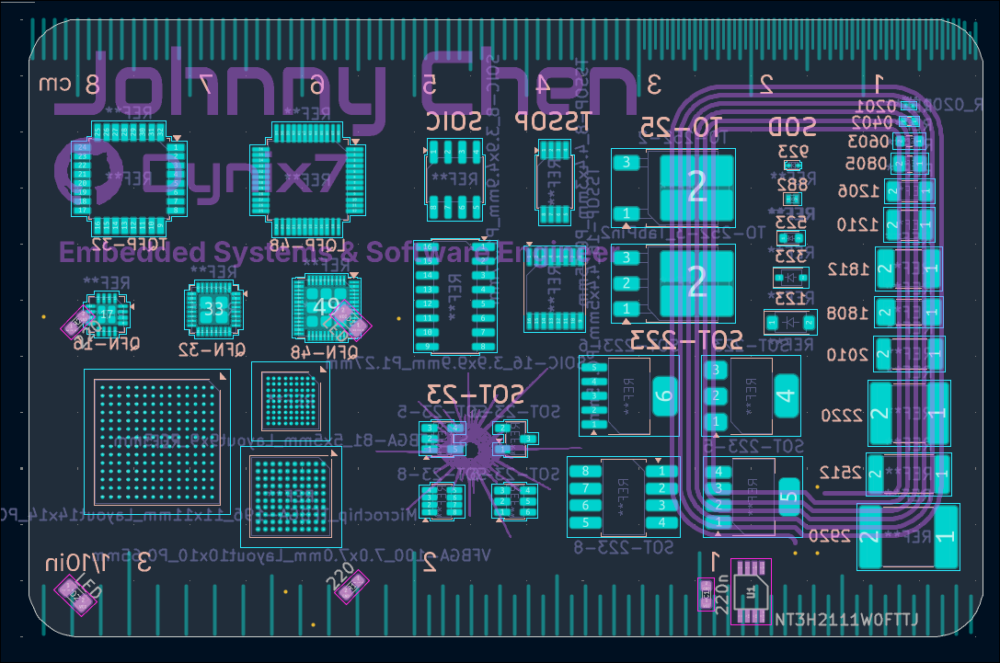
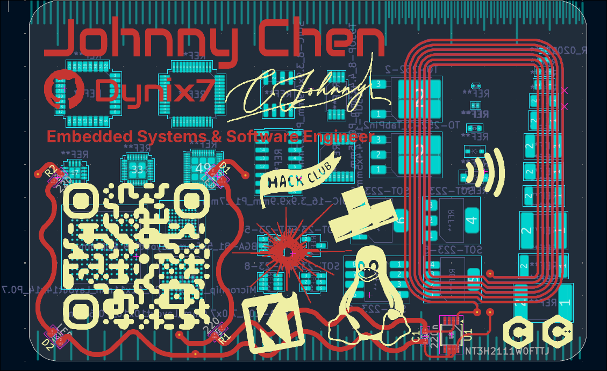
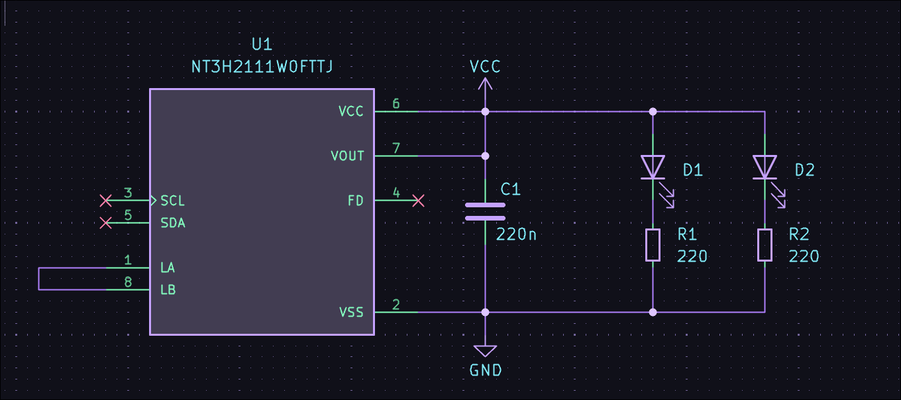

# NFC Business Card
This is my design for a personal NFC Business Card that I've put my name, title, and some things I like. It features a NFC chip so that you can scan it using your phone and it'll bring you to my GitHub or anything else that you want. TThere is also a QR code that you can scan with your phone that will bring you to my GitHub page. It also has a variety of footprints on the back for reference.

# Why I Made It
I firstly wanted something that I could put my name and to illustrate my skills in programming, PCB design, etc. I also wanted to create art with this and express myself by putting the things I like the most. On the back I included footprints and a ruler for helping my visualize component sizes and general use.

# PCB Photos

# PCB Editor Photos

# Schematic Photos
