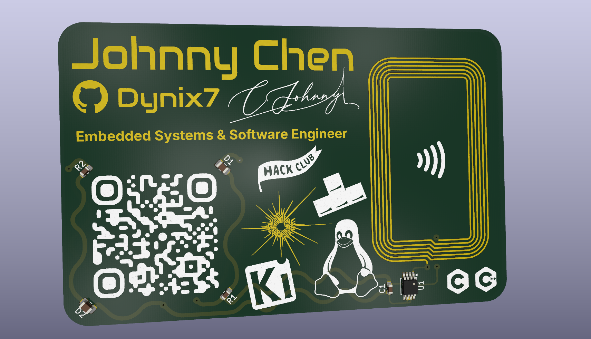
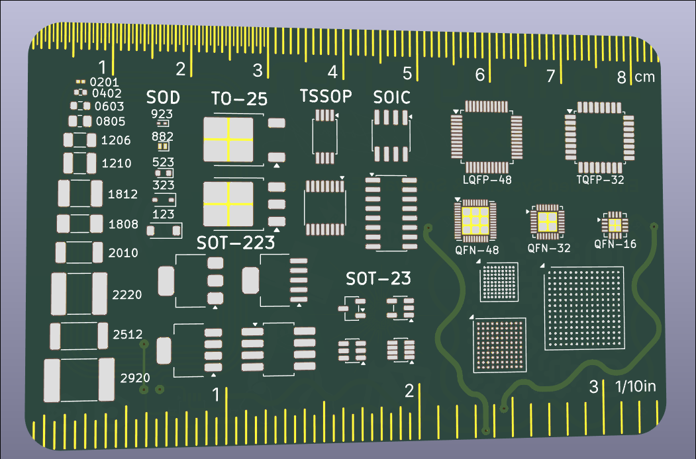
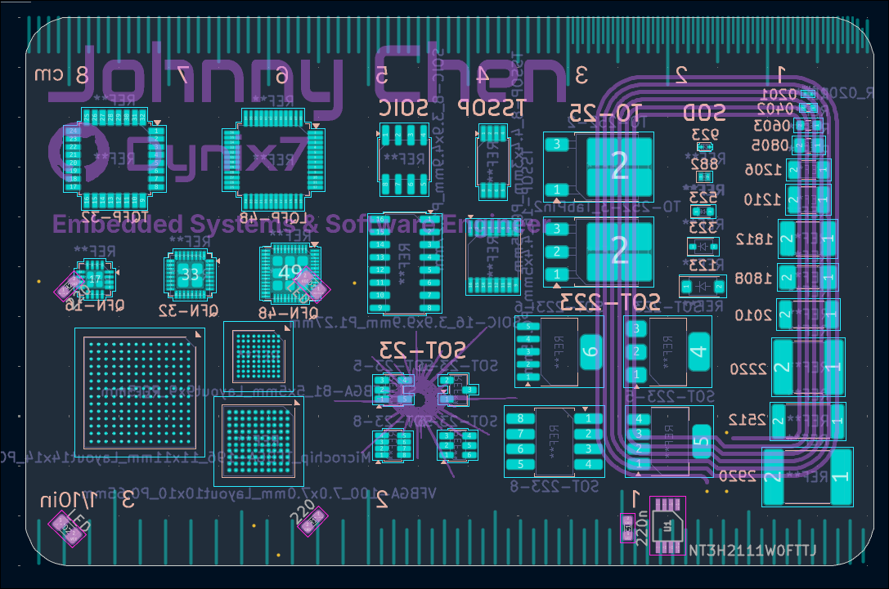
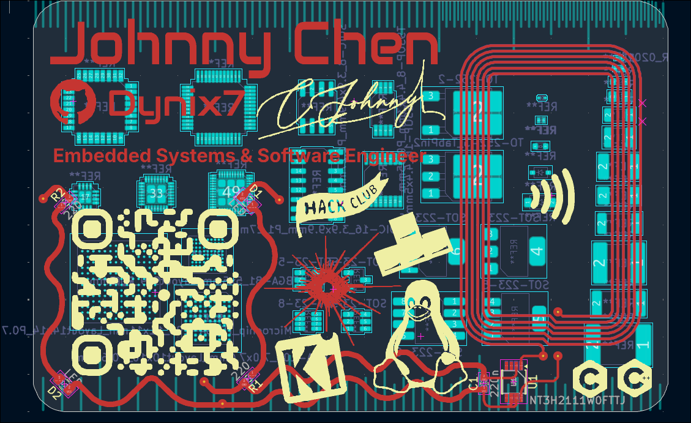
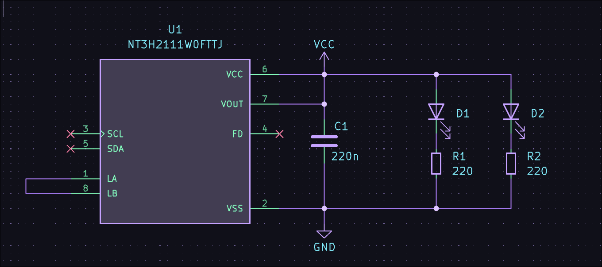

# NFC Business Card
This is my design for a personal NFC Business Card that I've put my name, title, and some things I like. It features a NFC chip so that you can scan it using your phone and it'll bring you to my GitHub or anything else that you want. TThere is also a QR code that you can scan with your phone that will bring you to my GitHub page. It also has a variety of footprints on the back for reference.

# Why I Made It
I firstly wanted something that I could put my name and to illustrate my skills in programming, PCB design, etc. I also wanted to create art with this and express myself by putting the things I like the most. On the back I included footprints and a ruler for helping my visualize component sizes and general use.

# PCB Photos

# PCB Editor Photos

# Schematic Photos

# BOM
|Name                 |Purpose          |Total Cost (USD)|Link                                                                                    |Distributor     |
|---------------------|-----------------|----------------|----------------------------------------------------------------------------------------|----------------|
|NT3H2111W0FTTJ       |NFC Chip         |$1.37           |https://www.digikey.com/en/products/detail/nxp-usa-inc/NT3H2111W0FTTJ/5872979           |Digikey         |
|220ohm Resistor      |Resistor for LEDs|$0.12           |https://www.digikey.com/en/products/detail/yageo/RT0603FRE10220RL/21619987              |Digikey         |
|Green LEDs           |Indicator for PCB|$0.75           |https://www.digikey.com/en/products/detail/liteon/LTST-S220KGKT/386875                  |Digikey         |
|220nf Capacitor      |Stabilize Power  |$0.56           |https://www.digikey.com/en/products/detail/murata-electronics/GCM188R71E224KA55D/1765183|Digikey         |
|JLCPCB Costs         |Main PCB         |$21             |                                                                                        |JLCPCB          |
|Shipping+Fees+Tarrifs|                 |$11.16          |                                                                                        |Digikey + JLCPCB|
